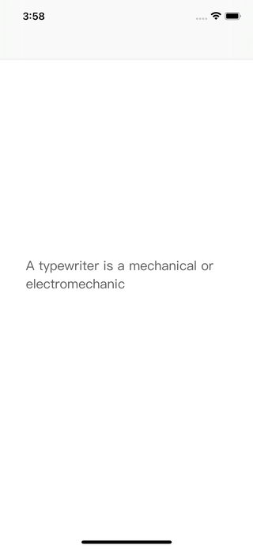

# WWTypewriterLabel

[](https://developer.apple.com/swift/) [](https://developer.apple.com/swift/)  [](https://developer.apple.com/swift/) [](https://developer.apple.com/swift/)

## [Introduction - 簡介](https://swiftpackageindex.com/William-Weng)
- Mimics the display function of a typewriter.
- 模仿打字機的顯示功能。

## [Achievements display - 成果展示](https://www.hkweb.com.hk/blog/ui設計基礎知識：引導頁對ui設計到底有什麼作用/)


## [Installation with Swift Package Manager - 安裝方式](https://medium.com/彼得潘的-swift-ios-app-開發問題解答集/使用-spm-安裝第三方套件-xcode-11-新功能-2c4ffcf85b4b)

```bash
dependencies: [
    .package(url: "https://github.com/William-Weng/WWTypewriterLabel.git", .upToNextMajor(from: "1.0.0"))
]
```

## Function - 可用函式

|函式|功能|
|-|-|
|start(fps:stringType:loopType:)|開始打字機顯示功能|
|stop(isShowFull:)|停止打字機顯示功能|

## Example - 程式範例
```swift
import UIKit
import WWPrint
import WWTypewriterLabel

final class ViewController: UIViewController {

    @IBOutlet weak var typewriterLabel: WWTypewriterLabel!
    
    override func viewDidLoad() {
        super.viewDidLoad()
        typewriterTest()
    }
    
    func typewriterTest() {
        
        let string = "A typewriter is a mechanical or electromechanical machine for typing characters. Typically, a typewriter has an array of keys, and each one causes a different single character to be produced on paper by striking an inked ribbon selectively against the paper with a type element. At the end of the nineteenth century, the term 'typewriter' was also applied to a person who used such a device."
        
        let formattedText = NSAttributedString(string: string, attributes: [
            .font: UIFont.systemFont(ofSize: 20),
            .foregroundColor: UIColor.blue
        ])
        
        typewriterLabel.start(fps: 60, stringType: .general(string), loopType: .once)

        DispatchQueue.main.asyncAfter(deadline: .now() + 5) {
            self.typewriterLabel.start(fps: 30, stringType: .attributed(formattedText), loopType: .infinity)
        }
    }
}
```
